```python
import numpy as np 
import pandas as pd 
import seaborn as sns
import matplotlib.pyplot as plt 
import warnings 
from sklearn.model_selection import train_test_split
from sklearn.linear_model import LinearRegression
from sklearn.preprocessing import OneHotEncoder
from sklearn.compose import ColumnTransformer
from sklearn.pipeline import Pipeline
from sklearn.metrics import mean_absolute_error, mean_squared_error
from sklearn.model_selection import cross_val_score
warnings.filterwarnings("ignore")

df=pd.read_csv("Health_Sleep_Statistics.csv")
print(df.info())
print(df.isnull().sum())
print(df.head())
```

    <class 'pandas.core.frame.DataFrame'>
    RangeIndex: 100 entries, 0 to 99
    Data columns (total 12 columns):
     #   Column                   Non-Null Count  Dtype 
    ---  ------                   --------------  ----- 
     0   User ID                  100 non-null    int64 
     1   Age                      100 non-null    int64 
     2   Gender                   100 non-null    object
     3   Sleep Quality            100 non-null    int64 
     4   Bedtime                  100 non-null    object
     5   Wake-up Time             100 non-null    object
     6   Daily Steps              100 non-null    int64 
     7   Calories Burned          100 non-null    int64 
     8   Physical Activity Level  100 non-null    object
     9   Dietary Habits           100 non-null    object
     10  Sleep Disorders          100 non-null    object
     11  Medication Usage         100 non-null    object
    dtypes: int64(5), object(7)
    memory usage: 9.5+ KB
    None
    User ID                    0
    Age                        0
    Gender                     0
    Sleep Quality              0
    Bedtime                    0
    Wake-up Time               0
    Daily Steps                0
    Calories Burned            0
    Physical Activity Level    0
    Dietary Habits             0
    Sleep Disorders            0
    Medication Usage           0
    dtype: int64
       User ID  Age Gender  Sleep Quality Bedtime Wake-up Time  Daily Steps  \
    0        1   25      f              8   23:00        06:30         8000   
    1        2   34      m              7   00:30        07:00         5000   
    2        3   29      f              9   22:45        06:45         9000   
    3        4   41      m              5   01:00        06:30         4000   
    4        5   22      f              8   23:30        07:00        10000   
    
       Calories Burned Physical Activity Level Dietary Habits Sleep Disorders  \
    0             2500                  medium        healthy              no   
    1             2200                     low      unhealthy             yes   
    2             2700                    high        healthy              no   
    3             2100                     low      unhealthy             yes   
    4             2800                    high         medium              no   
    
      Medication Usage  
    0               no  
    1              yes  
    2               no  
    3               no  
    4               no  
    


```python
print(df.describe())
```

              User ID         Age  Sleep Quality   Daily Steps  Calories Burned
    count  100.000000  100.000000     100.000000    100.000000        100.00000
    mean    50.500000   36.010000       7.000000   6830.000000       2421.00000
    std     29.011492    8.454865       1.734964   2498.706736        281.06759
    min      1.000000   22.000000       4.000000   3000.000000       2000.00000
    25%     25.750000   28.750000       5.750000   4750.000000       2175.00000
    50%     50.500000   35.000000       7.500000   6750.000000       2400.00000
    75%     75.250000   44.000000       8.250000   9000.000000       2700.00000
    max    100.000000   50.000000       9.000000  11000.000000       2900.00000
    


```python
print(df["Sleep Quality"])
```

    0     8
    1     7
    2     9
    3     5
    4     8
         ..
    95    7
    96    8
    97    4
    98    9
    99    6
    Name: Sleep Quality, Length: 100, dtype: int64
    


```python

```


```python
correlation_matrix = df[['Age', 'Sleep Quality', 'Daily Steps', 'Calories Burned']].corr()
sns.heatmap(correlation_matrix, annot=True, cmap='coolwarm')
plt.title('Correlation Matrix')
plt.show()
```


    
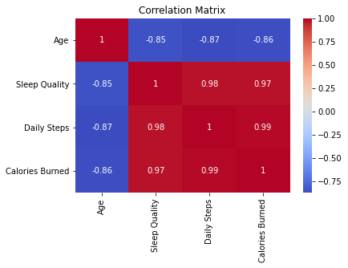
    


```python
sns.histplot(df['Age'], bins=15, kde=True)
plt.title('Distribution of Age')
plt.show()
```


    
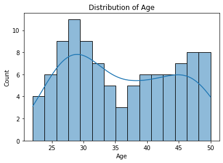
    


```python
sns.countplot(x='Gender', data=df)
plt.title('Gender Distribution')
plt.show()
```


    
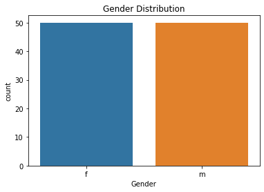
    


```python
df['Bedtime'] = pd.to_datetime(df['Bedtime'], format='%H:%M')
df['Bedtime Hour'] = df['Bedtime'].dt.hour + df['Bedtime'].dt.minute / 60
sns.histplot(df['Bedtime Hour'], bins=50, kde=True)
plt.title('Distribution of Bedtime')
plt.xlabel('Hour of the Day')
plt.show()
```


    
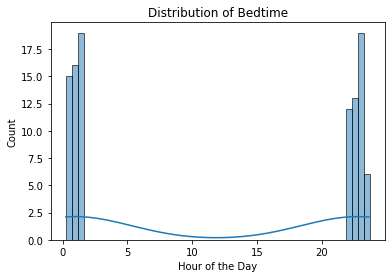
    


```python
df['Wake-up Time'] = pd.to_datetime(df['Wake-up Time'], format='%H:%M')
df['Wake-up Hour'] = df['Wake-up Time'].dt.hour + df['Wake-up Time'].dt.minute / 60
sns.histplot(df['Wake-up Hour'], bins=24, kde=True)
plt.title('Distribution of Wake-up Time')
plt.xlabel('Hour of the Day')
plt.show()

```


    
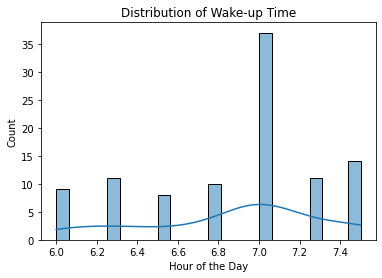
    


```python
sns.histplot(df['Daily Steps'], bins=10, kde=True)
plt.title('Distribution of Daily Steps')
plt.show()
```


    
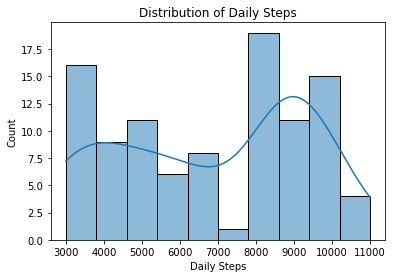
    


```python
sns.histplot(x = 'Physical Activity Level', data = df, color='red')

plt.show()
```


    
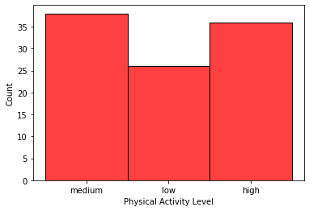
    


```python
sns.histplot(x = 'Dietary Habits', data = df, color='red')
plt.show()
```


    
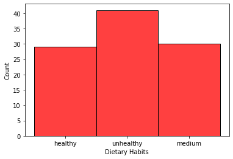
    


```python
sns.histplot(x = 'Sleep Disorders', data = df, color='red')
plt.show()
```


    
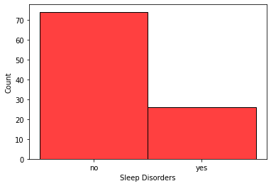
    


```python
sns.histplot(x = 'Medication Usage', data = df, color='red')
plt.show()

```


    
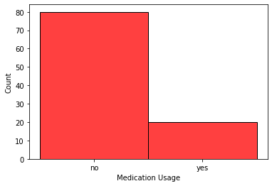
    


```python
sns.scatterplot(x = 'Age', y ='Calories Burned',data = df, color='red')
plt.title("Age vs Calories Burned")
plt.show()
```


    
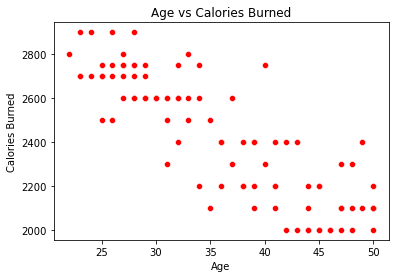
    


```python
sns.scatterplot(x = 'Age', y ='Sleep Quality',data = df, color='red')
plt.title("Age vs Sleep Quality")
plt.show()
```


    
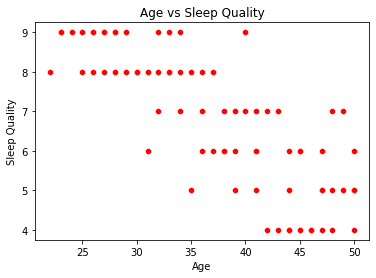
    


```python
sns.scatterplot(x = 'Age', y ='Daily Steps',data = df, color='red')
plt.title("Age vs Daily Steps")
plt.show()
```


    
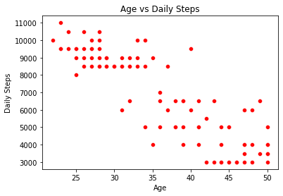
    


```python
sns.scatterplot(x = 'Calories Burned', y ='Daily Steps',data = df, color='red')
plt.title("Calories Burned vs Daily Steps")
plt.show()
```


    
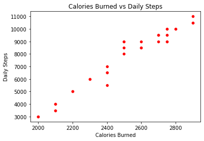
    


```python
sns.scatterplot(x = 'Calories Burned', y ='Sleep Quality',data = df, color='red')
plt.title("Calories Burned vs Sleep Quality")
plt.show()
```


    
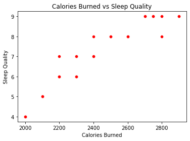
    


```python
sns.boxplot(x='Gender', y='Sleep Quality', data=df)
plt.title('Sleep Quality by Gender')
plt.show()
```


    
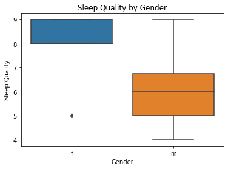
    


```python
categorical_features = ['Gender', 'Physical Activity Level', 'Dietary Habits', 'Sleep Disorders', 'Medication Usage']
numeric_features = ['Age', 'Daily Steps', 'Calories Burned']

X = df[categorical_features + numeric_features]
y = df['Sleep Quality']

preprocessor = ColumnTransformer(
    transformers=[
        ('cat', OneHotEncoder(), categorical_features),
        ('num', 'passthrough', numeric_features)
    ])

model = Pipeline(steps=[('preprocessor', preprocessor),
                        ('regressor', LinearRegression())])

X_train, X_test, y_train, y_test = train_test_split(X, y, test_size=0.2, random_state=42)

model.fit(X_train, y_train)

print("Model R^2 Score: ", model.score(X_test, y_test))

y_pred = model.predict(X_test)
mae = mean_absolute_error(y_test, y_pred)
mse = mean_squared_error(y_test, y_pred)
rmse = np.sqrt(mse)

print(f"Mean Absolute Error (MAE): {mae}")
print(f"Mean Squared Error (MSE): {mse}")
```

    Model R^2 Score:  0.9577274939105904
    Mean Absolute Error (MAE): 0.25126664889803085
    Mean Squared Error (MSE): 0.13305271291641668
    


```python
residuals = y_test - y_pred

plt.figure(figsize=(10, 5))
plt.subplot(1, 2, 1)
sns.histplot(residuals, kde=True)
plt.title('Residuals Distribution')

plt.subplot(1, 2, 2)
plt.scatter(y_pred, residuals)
plt.axhline(0, color='red', linestyle='--')
plt.title('Residuals vs Fitted values')
plt.xlabel('Fitted values')
plt.ylabel('Residuals')

plt.tight_layout()
plt.show()
```


    
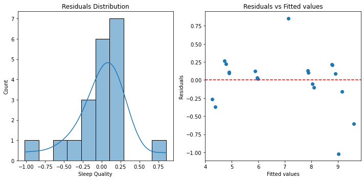
    


```python
new_data = pd.DataFrame({
    'Gender': [input("Gender (f/m): ")],
    'Physical Activity Level': [input("Physical Activity Level (low/medium/high): ")],
    'Dietary Habits': [input("Dietary Habits (unhealthy/medium/healthy): ")],
    'Sleep Disorders': [input("Sleep Disorders (yes/no): ")],
    'Medication Usage': [input("Medication Usage (yes/no): ")],
    'Age': [int(input("Age: "))],
    'Daily Steps': [int(input("Daily Steps: "))],
    'Calories Burned': [int(input("Calories Burned: "))]
})

prediction = model.predict(new_data)
print(f"Predicted Sleep Quality: {prediction[0]}")
```

    Gender (f/m): m
    Physical Activity Level (low/medium/high): medium
    Dietary Habits (unhealthy/medium/healthy): medium
    Sleep Disorders (yes/no): no
    Medication Usage (yes/no): no
    Age: 23
    Daily Steps: 5000
    Calories Burned: 3000
    Predicted Sleep Quality: 8.411572763885449
    
